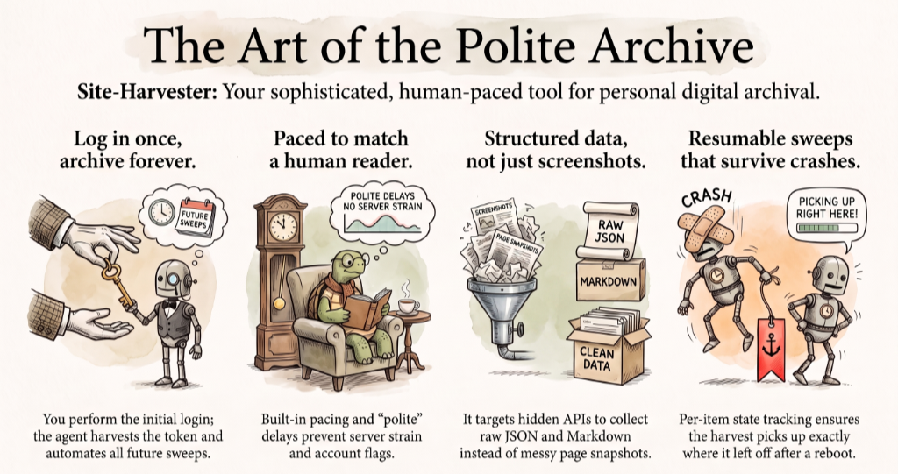

**[English](README.md)** | [한국어](README.ko.md)

> 이 문서는 [README.md](README.md)의 한국어 번역입니다. 원문(영어)이 항상 최신 상태이며, 내용이 다를 수 있습니다.



<center><h1>site-harvester</h1></center>

> 로그인해야 볼 수 있는 콘텐츠, 전부 긁어서 로컬에 쌓아두기 — 정중한 속도로, 끊어도 이어서, 예약까지 걸어서.

많은 회원제 사이트는 React 같은 SPA 프레임워크 뒤에 JSON API를 두고 있습니다. 화면엔 글이 보이지만 실제 데이터는 뒤쪽 JSON API로 오가죠. 이 플러그인은 그 숨은 API를 찾아내고, 진짜 브라우저로 한 번만 로그인해서 토큰을 얻은 다음, 그다음부턴 평범한 API 호출로 모든 콘텐츠를 가져옵니다. 사람이 읽는 속도로 천천히, 중간에 꺼져도 딱 그 자리부터 다시, 그리고 새 글은 cron이 알아서 받아옵니다. API가 없는 사이트도 됩니다 — RSS 피드(`rss` 모드)나 로그인 브라우저 프로필로 렌더링한 페이지(`dom` 모드)로 수집합니다.

Claude Code, Codex, Antigravity, Hermes Agent 어디서든 동작합니다. 로그인이 필요한 대규모 SPA 사이트에서 검증했습니다 — 전체 아카이브 초기 수집은 며칠에 걸쳐, OAuth 로그인, 이후 예약된 증분 수집까지.

## 설치

```bash
# Claude Code
claude plugin marketplace add epicsagas/plugins
claude plugin install site-harvester@epicsagas

# Codex
codex plugin marketplace add epicsagas/plugins
codex plugin add site-harvester

# Antigravity
agy plugin install https://github.com/epicsagas/site-harvester

# Hermes Agent — 설치 스캐너가 이 플러그인의 AGENTS.md 가이드를 CRITICAL
# "persistence"로 오탐합니다(에이전트 설정 파일 언급 전부를 잡는 휴리스틱).
# dangerous 판정은 --force로도 못 푸니, 설치 스캔을 잠깐 끄고 설치한 뒤 복구:
hermes config set plugins.scan_on_install false
hermes plugins install https://github.com/epicsagas/site-harvester --enable
hermes config set plugins.scan_on_install true
hermes gateway restart
```

## 시작하기

준비물: Python 3.10 이상, 에이전트 호스트(Claude Code / Codex / Antigravity / Hermes Agent), 그리고 대상 사이트의 본인 계정.

```
나: "https://example.com 아티클 전부 수집해줘. 멤버십 로그인 필요하고
     나 구독 중이야. 새로 올라오는 것도 2주 동안 계속 받아줘."
```

끝입니다. 스킬이 리콘 → 스캐폴딩 → 로그인 → 스모크 테스트 → 예약 수집까지 알아서 진행합니다. 브라우저 창이 열리면 직접 한 번 로그인하고, 그다음부터는 전부 자동입니다.

## 동작 방식

| | 단계 | 하는 일 |
|--|------|---------|
| 🔍 | 리콘 | RSS 피드 확인 + 사이트 JS 번들을 그레프해서 숨은 API 찾기 — 엔드포인트, 페이지네이션, 토큰 저장 위치, 모드 결정 |
| 🔑 | 토큰 수확 | 브라우저 로그인(사용자가 직접, 한 번만). 사이트가 발급한 토큰을 로컬 프로필에 보관 |
| 📦 | 수집 | 사람 속도로 스윕 — API 호출, 피드 항목 또는 렌더링 페이지, 이미지도 함께 다운로드 |
| 🔁 | 이어받기 | 아이템 단위 상태 파일 — 크래시, Ctrl-C, 재부팅 후에도 멈춘 자리부터 정확히 |
| ⏰ | 예약 | cron으로 신규 콘텐츠 수집, 수집 기간이 지나면 스스로 종료 |
| 🗄️ | 데이터 레이어 | 원본 API JSON을 그대로 커밋 — 노트와 로컬 리더도 전부 여기서 파생 |

사이트별 코드는 템플릿 최상단의 `SITE` 어댑터 블록 하나뿐입니다. 모드를 고르고 — `api`(JSON 엔드포인트), `rss`(피드가 인덱스), `dom`(로그인 프로필로 렌더링 페이지) — 리콘 결과로 그 모드의 훅만 채우면 됩니다. 나머지(flock, 401 자동 갱신, HTML→마크다운, 이미지 처리, 커밋)는 전부 공통 코드입니다.

## 왜 site-harvester인가?

| | site-harvester | 직접 짠 Playwright | ArchiveBox | wget/httrack |
|-|----------------|--------------------|------------|--------------|
| 로그인 필요한 콘텐츠 | ✅ 본인 세션 토큰 | ✅ 다만 깨지기 쉬움 | ⚠️ 제한적 | ❌ |
| 속도 | ✅ API 직접 호출 | ⚠️ 페이지 로드 비용 | ⚠️ 무거움 | ✅ |
| 중간에 끊겼을 때 | ✅ 아이템 단위 | 🔧 직접 구현 필요 | ✅ | ⚠️ |
| 신규 글 예약 수집 | ✅ 기본 내장 | 🔧 직접 구현 필요 | ✅ | ❌ |
| 구조화된 JSON 출력 | ✅ API 응답 원본 | 🔧 DOM 파싱 필요 | ⚠️ | ❌ |
| 페이지 전체 스냅샷 | ❌ | ⚠️ | ✅ | ✅ |

페이지 스크린샷이나 WARC가 필요하면 ArchiveBox를 쓰세요. 전문(full-content) RSS 피드가 있는 사이트는 로그인 없이 `rss` 모드로 수집하고, API가 아예 없는 사이트는 `dom` 모드(로그인 브라우저 프로필)로 됩니다. 그 외의 모든 경우, 이 플러그인이 "내가 직접 소유해야 하는 코드"를 줄여줍니다.

## 자주 묻는 질문

<details>
<summary>수집한 아카이브를 웹사이트처럼 읽고 싶어요</summary>

가능합니다 — `collect.py`의 선택적 `norm_*` 훅을 채우고
`collect.py --rebuild-site`를 실행한 뒤 `python3 site/serve.py`를 실행하세요.
검색·시리즈·필진·태그·아카이브·다크 테마를 갖춘 의존성 없는 리더가
정규화된 `data/site/` 레이어를 http://127.0.0.1:8765 로 서빙합니다.
localhost 전용입니다: 유료 콘텐츠의 저작권은 그대로이므로 리더를
네트워크에 노출하지 않습니다.
</details>

<details>
<summary>수집 도중 토큰이 만료됐어요</summary>

수집기가 401을 감지하면 브라우저 프로필로 헤드리스 재발급을 시도합니다. 세션 쿠키까지 죽었다면 `python3 scraper/login.py`를 한 번 더 실행하면 됩니다.
</details>

<details>
<summary>사이트가 개편됐어요</summary>

리콘 단계를 다시 돌리고 `SITE` 딕셔너리만 고치세요. 이미 받아둔 원본 JSON은 그대로 살아 있어서, 노트는 다시 받지 않고도 재생성됩니다(`--rebuild-notes`).
</details>

<details>
<summary>collect.py가 "tos_ok is False"로 종료돼요</summary>

새 사이트는 약관 확인이 끝나지 않은 상태로 시작합니다. Phase 1에서 이용약관의 자동화 금지 조항을 확인한 뒤 `SITE` 블록의 `"tos_ok"`를 `True`로 바꾸세요. 오프라인 재생성(`--rebuild-notes`)에는 필요 없습니다.
</details>

<details>
<summary>HTTP 403/429로 수집이 멈췄어요</summary>

사이트가 차단하거나 속도 제한을 걸었다는 뜻입니다 — 수집기는 억지로 밀어붙이지 않고 즉시 멈춥니다. 기다렸다가 `--pace`를 늘리거나 수집 자체를 재고하세요. IP를 돌려가며 접속하지 마세요.
</details>

<details>
<summary>커밋이 안 돼요: "origin is a PUBLIC repo"</summary>

수집물은 절대 공개 리포에 들어가면 안 됩니다 — 커밋 전 `gh`로 리포 공개 여부를 확인해 public이면 거부합니다. 볼트 리포를 비공개로 바꾸거나 (`gh repo edit --visibility private`) 리모트를 제거하세요.
</details>

<details>
<summary>--pace가 5초 미만으로 거부돼요</summary>

사람 속도는 설계 불변값이라 하한을 설정에서 풀 수 없습니다. 빠른 확인이 필요하면 `--limit 3`을 쓰세요 — 3~8초 간격으로 돕니다.
</details>

<details>
<summary>이거 합법인가요?</summary>

본인이 결제한 계정으로 접근 가능한 콘텐츠만, 사람이 읽는 속도로, 개인 아카이브 목적으로만 다룹니다. CAPTCHA 우회, 안티봇 회피, IP 로테이션, 결제벽 우회는 애초에 없습니다 — 의도된 설계이고, 템플릿에서 속도 설정을 무단으로 풀기 어렵게 만들어 뒀습니다. 수집 전 사이트 약관과 해당 국가 법률을 확인하고(나라마다 다름), 용도는 개인·비영리로만 제한하며, 수집물은 절대 재게시하지 마세요. 유료 콘텐츠는 저작권이 살아 있고, 사이트도 localhost로만 띄워야 합니다.
</details>

## 면책 고지

이 플러그인은 정상적으로 구독 중인 콘텐츠의 개인 아카이빙용으로 제공됩니다. 코드 변경, 내장 가드레일 우회(약관 확인, 수집 속도, 차단 처리, 비공개 리포 강제), 사이트 약관이나 해당 법령을 위반하는 사용, 수집물의 재게시·재배포 — 이 모든 사용은 본인 책임이며, 발생하는 모든 문제의 책임은 사용자에게 있습니다. 개발자는 오용에 대해 어떠한 책임도 지지 않습니다.

## 기여

[CONTRIBUTING.md](CONTRIBUTING.md)를 참고하세요. 새 사이트 어댑터 예시는 특히 환영합니다.

## 라이선스

[MIT](LICENSE)
